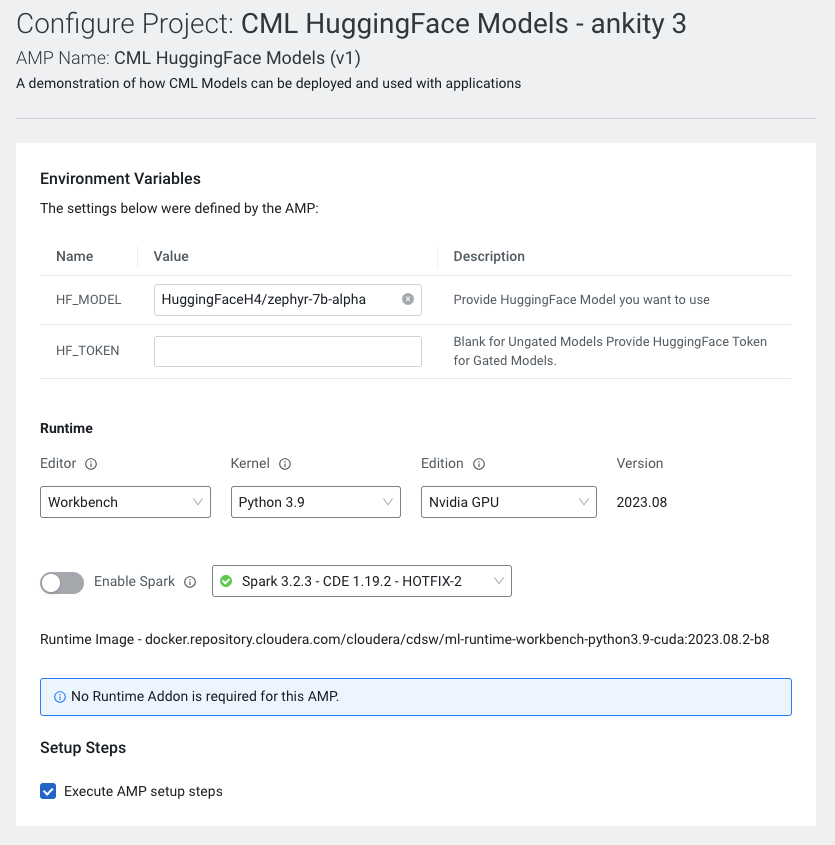
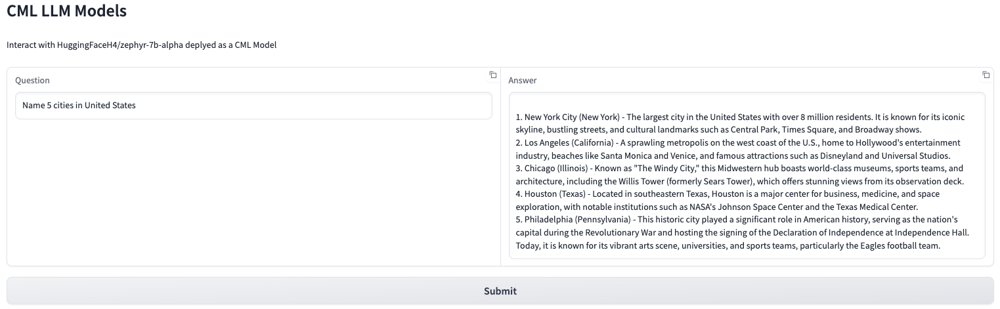

# CML HuggingFace Models

Choose any 7B or 13B LLM from HuggingFace and deploy as a CML Model. Cloudera Machine Learning models expose an Inference endpoint for users to access and communicate with. The AMP creates a Gradio App UI which can be used to interact with the deployed CML Model.

## Key Features
- Launch any 7B or 13B HuggingFace Model(Can be configured for larger models after deployment)
- Deploys CML Model with 1 replica
- Deploys CML Gradio Application which interacts with deployed CML Model

## Prerequisite
Increase Ephemeral Storage Limit by navigating to CML Workspace -> Site Administration -> Settings -> Ephemeral Storage (in GB) and set it to a value >= 50

When a CML model is created, the model is loaded in the scratch space of a pod, LLM models are larger than the default 10 GB which causes issues during deployment.

## Resource Requirements
The AMP Model has been configured to use the following
- 4 CPU
- 32 GB RAM
- 1 GPUs

## Steps to Configure CML AMP
1. Navigate to CML Workspace -> Site Administration -> AMPs Tab

2. Under AMP Catalog Sources section, We will "Add a new source By" selecting "Catalog File URL"

3. Provide the following URL and click "Add Source"
```
https://raw.githubusercontent.com/nkityd09/cml_catalog/main/catalog.yaml
```

4. Once added, We will be able to see the CML HuggingFace Models in the AMP section and deploy it from there.

5. Click on the AMP and "Configure Project"
   - Add HuggingFace Model Name, defaults to HuggingFaceH4/zephyr-7b-alpha
   - If accessing a gated model, add HuggingFace token. Can be left blank for non gated models


6. Once the AMP steps are completed, We can access the Gradio UI via the Applications page.

## CML Application in Action

The CML Application serves a Gradio UI to interact with an LLM deployed as CML Model

The Gradio UI provides a Question Textbox which can be used to send questions to the CML Model. The submit button sends the request, its response is displayed in the Answer Text Box. 

